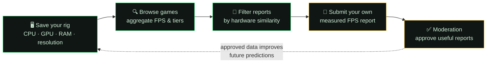
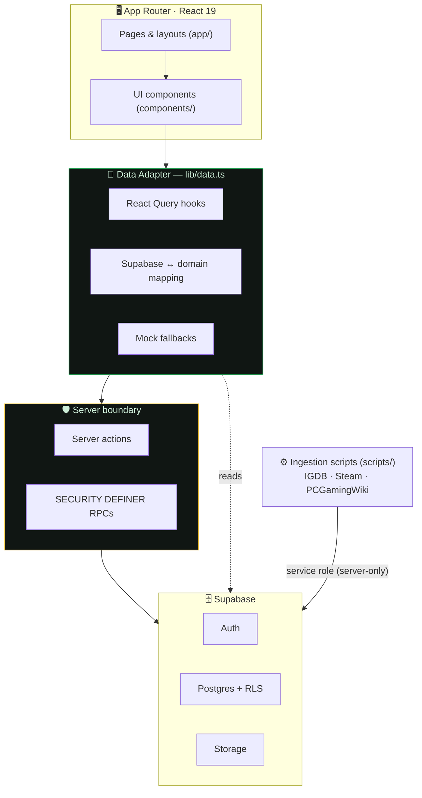

<div align="center">



<br/>

[](https://github.com/eduardotai/rundb/actions/workflows/ci.yml)


**RunDB is a community performance database for real PC hardware.**
It answers the practical question behind every system-requirements chart:

> *Can my machine run this game, at what settings — and what did people with similar hardware actually report?*

Think **ProtonDB, but for measured FPS** — graphics settings, hardware profiles, tweaks, and compatibility confidence across real CPUs, GPUs, RAM, drivers, kernels, and resolutions.

[Quick Start](#-quick-start) · [How It Works](#-how-it-works) · [Architecture](#%EF%B8%8F-architecture) · [Environment](#-environment-variables) · [Scripts](#%EF%B8%8F-scripts) · [Deploying](#-public-deploy-prep) · [Contributing](#-contributing)

</div>

---

> [!IMPORTANT]
> **This repo uses Next.js 16, which has breaking changes vs. older versions.** APIs, conventions, and file structure may differ from what you (or your AI assistant) remember. Before touching Next.js-specific code, read the relevant guide in `node_modules/next/dist/docs/`. This rule lives in [`AGENTS.md`](./AGENTS.md) and applies to every contribution.

## ✨ Highlights

| | |
|---|---|
| 📊 **Real measurements** | CPU, GPU, RAM, resolution, preset, average FPS, 1% lows, notes, issues, and tweaks — not vague "minimum spec" guessing |
| 🔮 **Hardware-aware predictions** | Compatibility confidence based on your saved rig and reports from similar systems |
| 🗃️ **Structured hardware catalog** | Canonical CPU/GPU entries, aliases, normalization, browser detection, and paste-based rig capture |
| 🎮 **Game ingestion pipeline** | IGDB, Steam, and PCGamingWiki enrichment with covers, metadata, media, and retry-friendly queues |
| 🛡️ **Built-in moderation** | Server actions + `SECURITY DEFINER` RPCs with rate limiting, duplicate checks, and approval flow |
| 🔌 **Dual-mode data layer** | Supabase-backed real data with defensive mock fallbacks for local dev and demos |

### Performance tiers

Every approved report rolls up into one of five tiers (see [`lib/types.ts`](./lib/types.ts)):

🟢 `Excellent` · 🟩 `Good` · 🟡 `Playable` · 🟠 `Struggling` · 🔴 `Unplayable`

## 🔁 How It Works

RunDB is a feedback loop between a player's saved hardware profile and the community's measured reports:



## 🚀 Quick Start

```bash
git clone https://github.com/eduardotai/rundb.git
cd rundb
npm install
cp .env.example .env.local   # fill in what you need (see below)
npm run dev
```

Open <http://localhost:3000> — that's it. 🎉

> [!TIP]
> No Supabase project yet? The app can run with **mock data** for local development and demos. Set `NEXT_PUBLIC_ALLOW_MOCK_DATA` and skip the real keys until you're ready.

**Requirements:** Node.js 20+, npm. A Supabase project for real-data mode. Optional IGDB/Twitch credentials for game ingestion and a Steam Web API key for account linking.

## 🏗️ Architecture

The **single most important rule** in this codebase:

> [!IMPORTANT]
> **All app surfaces go through the shared data adapter in [`lib/data.ts`](./lib/data.ts).** It centralizes real-vs-mock behavior, Supabase mapping, fallbacks, React Query hooks, report aggregation, cover enrichment, and prediction helpers. Don't call Supabase directly from UI code.



Supabase clients are **defensive by design** — missing keys, slow auth calls, or unreachable services should never break the local demo path. Real deploys still rely on RLS, server actions, and `SECURITY DEFINER` RPCs for protected writes.

<details>
<summary><strong>📁 Repository structure</strong></summary>

<br/>

```text
app/                 Next.js App Router pages, layouts, route handlers, and server actions
components/          Product UI, report cards, hardware inputs, admin tools, shadcn/ui primitives
docs/                Historical phase notes and supporting documentation
lib/                 Data adapter, Supabase clients, domain logic, hardware/catalog helpers
public/              Static assets and public catalog metadata
scripts/             Ingestion, seeding, verification, repair, and publishing scripts
seeds/               Seed datasets used by catalog and queue scripts
supabase/            Production schema, incremental SQL, and email templates
tests/               Node test runner coverage for pure logic and ingestion helpers
```

For deeper onboarding, start with [`CONTEXT.md`](./CONTEXT.md), then the folder-level `context.md` files (`app/`, `components/`, `lib/`, `scripts/`, `supabase/`, `tests/`, `seeds/`, `public/`).

</details>

<details>
<summary><strong>🧱 Data model at a glance</strong></summary>

<br/>

| Entity | What it holds |
| --- | --- |
| **Games** | Searchable catalog rows: slugs, external IDs, covers, genres, requirements, ingest status |
| **Reports** | Measured performance: game + hardware + settings + FPS + notes + votes + moderation status |
| **Profiles** | Supabase Auth extensions: username, avatar, role, primary-rig mirror fields |
| **User rigs** | Saved hardware profiles powering predictions and report prefill |
| **Hardware catalog** | Canonical CPU/GPU entries, aliases, metadata, performance indexes |
| **Game media** | Covers, screenshots, artworks, attribution, storage URLs |
| **Ingest queue** | Background enrichment jobs for growing the catalog safely |

Source of truth: [`supabase/schema.sql`](./supabase/schema.sql) and [`lib/types.ts`](./lib/types.ts).

</details>

## 🔐 Environment Variables

Copy `.env.example` to `.env.local` and fill in what you need:

| Variable | Required | Purpose |
| --- | :---: | --- |
| `NEXT_PUBLIC_SUPABASE_URL` | 🟢 real mode | Public Supabase project URL |
| `NEXT_PUBLIC_SUPABASE_ANON_KEY` | 🟢 real mode | Public Supabase anon key |
| `SUPABASE_SERVICE_ROLE_KEY` | 🟠 server ops | Server-only key for ingest, privileged actions, maintenance |
| `NEXT_PUBLIC_USE_REAL_DATA` | 🟢 recommended | Enables Supabase-backed reads and writes |
| `NEXT_PUBLIC_ALLOW_MOCK_DATA` | ⚪ dev only | Allows local mock-data behavior when explicitly enabled |
| `IGDB_CLIENT_ID` / `IGDB_CLIENT_SECRET` | ⚪ ingest only | Twitch/IGDB credentials for game metadata |
| `STEAM_WEB_API_KEY` | ⚪ optional | Steam profile, account linking, enrichment |

> [!WARNING]
> **Never expose `SUPABASE_SERVICE_ROLE_KEY`** in client-side code or public build output. It belongs to server-only scripts and privileged actions exclusively. Public deploys should use real Supabase keys and keep mock fallback **disabled** unless deliberately testing demo behavior.

## ⚙️ Scripts

The day-to-day three:

```bash
npm run dev     # start the dev server (webpack)
npm run lint    # ESLint
npm run test    # Node test runner
```

<details>
<summary><strong>🌱 Seeding & catalog scripts</strong></summary>

<br/>

| Command | Description |
| --- | --- |
| `npm run setup:supabase` | Prepare a Supabase project for real data |
| `npm run seed:hardware` | Seed the hardware catalog |
| `npm run verify:hardware` | Validate the hardware catalog |
| `npm run seed:games` | Seed starter games |
| `npm run build:seed` | Build a larger game seed queue |
| `npm run seed:queue` | Populate the ingest queue |

</details>

<details>
<summary><strong>📥 Ingestion & media scripts</strong></summary>

<br/>

| Command | Description |
| --- | --- |
| `npm run ingest:games` | Run direct game ingestion |
| `npm run ingest:worker -- --batch=50` | Process queued ingestion in batches |
| `npm run import:latest` | Import latest game candidates |
| `npm run reingest:covers` | Refresh covers and media |

The catalog grows in two phases: **skeleton rows** are inserted fast (seeds, bulk import, queues), then **enriched in the background** with IGDB/Steam/PCGamingWiki metadata, covers, screenshots, and requirements. The app stays usable while large catalogs process; failed rows stay visible in the queue for retry.

</details>

## 🚢 Public Deploy Prep

1. Create a Supabase project and add the required env vars to your host.
2. Run [`supabase/schema.sql`](./supabase/schema.sql) in the Supabase SQL editor.
3. `npm run seed:hardware` → `npm run seed:games`
4. `npm run build:seed` → `npm run seed:queue` → `npm run ingest:worker -- --batch=50`
5. Verify locally: `npm run lint && npm run test && npm run build`

## 🛡️ Security & Moderation

- Public report reads are limited to **approved content** only.
- Submissions flow through server actions + database RPCs: validation, rate limiting, duplicate checks, tier calculation.
- Moderator/admin access is gated by `profiles.role` + RLS policies.
- Service-role access is reserved for server-only scripts, ingestion, and privileged actions.
- Found a vulnerability? **Don't open a public issue** — see [`SECURITY.md`](./SECURITY.md) for private reporting.

> [!NOTE]
> RunDB is in active migration from a polished mock/localStorage prototype to a production real-data platform. Public game, report, profile, rig, hardware, and ingestion paths are designed for real Supabase operation; some admin moderation and bulk-management helpers are still migration areas. Current notes live in `app/context.md`, `lib/context.md`, and `supabase/context.md`.

## 🤝 Contributing

1. Read [`AGENTS.md`](./AGENTS.md), [`CONTEXT.md`](./CONTEXT.md), and the relevant folder's `context.md`.
2. Keep changes scoped; route data access through `lib/data.ts` or server-only helpers.
3. When adding fields, update **schema, types, mappers, RPCs, actions, forms, and docs together**.
4. Prefer focused tests for pure logic and risky data transformations.
5. Before opening a PR: `npm run lint && npm run test && npm run build`.

Full guide: [`CONTRIBUTING.md`](./CONTRIBUTING.md) · PR template: [`.github/pull_request_template.md`](./.github/pull_request_template.md) · Release notes: [`CHANGELOG.md`](./CHANGELOG.md)

## 💚 Free Forever & Donations

**RunDB is, and will mainly remain, free forever.** The project runs on a donation-based model to support its creator:

- ✅ You are **free to use, fork, and build on** this open-source project — no payment, no paywalls, no strings attached.
- 💝 Donations are **completely optional** and exist purely for one reason: helping. If you want to support the project with real money, it's appreciated — but never required.

## 📄 License

This project is licensed under the **MIT License** — see the [`LICENSE`](./LICENSE) file for details.

---

<div align="center">
<sub><code>$ rundb --check "my-machine"</code> → 🟢 <strong>Excellent</strong> · built with Next.js 16, React 19 & Supabase</sub>
</div>
